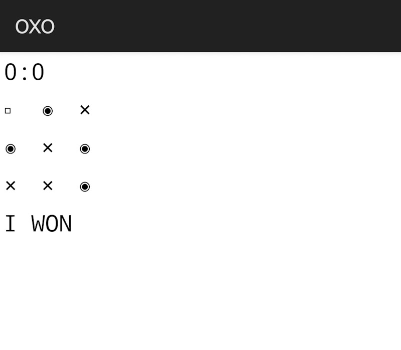

## OXO
Simple Android tic-tac-toe for educational purposes.
Android basic source (BASIC!, Laughton, 2011)

**References** 

Laughton, P. (2011). De Re BASIC!. *Manual*. https://github.com/RFO-BASIC/De-Re-Basic.
